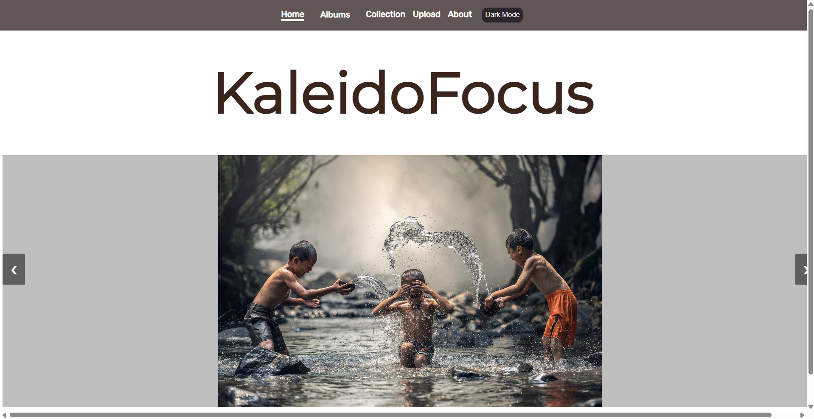
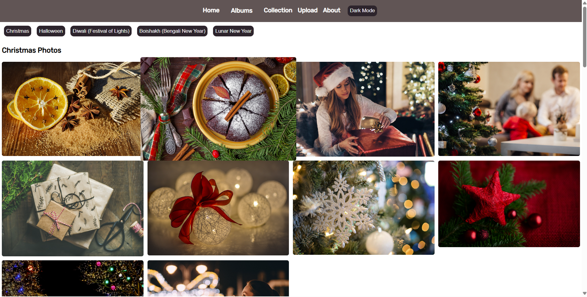
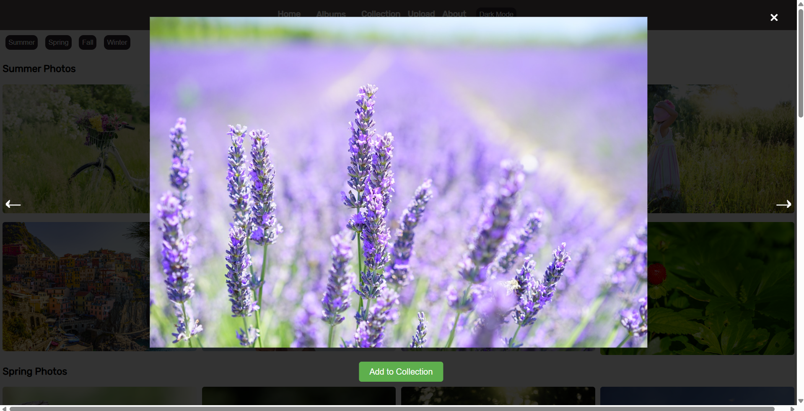
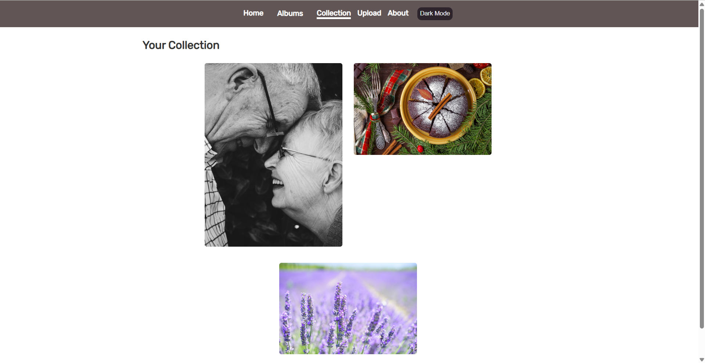

# 📸 Photography Website

A personal photography website that allows users to explore original creative works and experience them through a curated **online gallery view**. The purpose of this project is to showcase photography across various themes — such as **food, festivals, and locations** — and make it visually engaging and interactive.

Although this project was **officially published in 2025**, it was originally developed in **March 2023** as a creative and technical endeavor to combine web development with visual storytelling.

---

## 🌐 Features

- 🎨 **Slideshow Homepage** — Dynamic homepage slideshow displaying highlighted photos.
- 🗂️ **Themed Tabs** — Sections for **Food**, **Festivals**, and **Locations**, each with its own gallery.
- 🖼️ **Interactive Gallery View** — Clickable images that open in an expanded modal, with navigation.
- 📁 **Responsive Design** — Built to adapt to various screen sizes and devices.
- 💾 **Database Integration** — Uses **MySQL** to store image metadata and manage galleries efficiently.

---

## 🧰 Technologies Used

- **Frontend**: HTML5, CSS3, JavaScript
- **Backend**: PHP (served via WAMP)
- **Database**: MySQL (via phpMyAdmin)
- **Server Environment**: WAMP (Windows Apache MySQL PHP)

---

## 🖼️ Screenshots

### Homepage Slideshow

### Festivals Gallery

### Expanded Image View

## Collections Page

